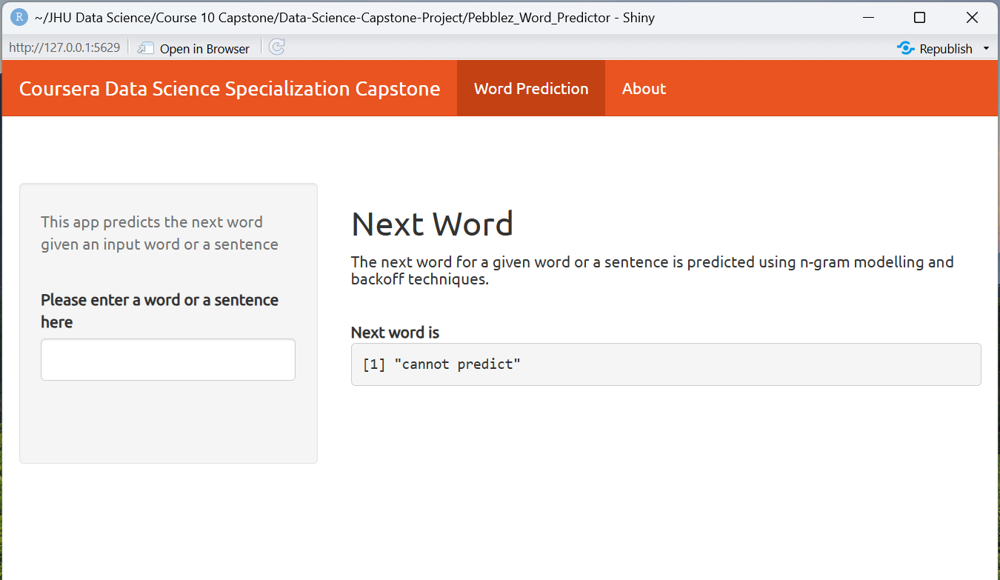

```{r setup, include=FALSE}
knitr::opts_chunk$set(echo = FALSE)
```

## Introduction

The Word Predictor App presented here presents my app submission for the final project of the [Data Science Capstone](https://www.coursera.org/learn/data-science-project) course, the last module of the [Data Science Specialization](https://www.coursera.org/specializations/jhu-data-science) series offered by Johns Hopkins University Bloomberg School of Public Health via Coursera.

The goal of this project was to develop a Shiny Application that can predict the next word based on user input. This presentation describes the dataset used, techniques implemented, and the application itself.

This involved key concepts including [Predictive Text Models](https://en.wikipedia.org/wiki/Predictive_text) and [Natural Language Processing (NLP)](https://en.wikipedia.org/wiki/Natural_language_processing).

## Dataset
<br/>
The data for this project come from a Coursera provided [corpus](https://d396qusza40orc.cloudfront.net/dsscapstone/dataset/Coursera-SwiftKey.zip) called HC Corpora. The corpora are collected from publicly available sources including

        -blogs
        -news
        -twitter
    
by a web crawler. Each entry is tagged with it's date of publication. Where user comments are included they will be tagged with the date of the main entry.
<br/>

## Techniques
The original data consisted of:

        -over 4 million lines of text 
        -almost 500,000 words

We created a sample from each file and analyzed a combined 150,000 lines of text. We prepocessed the data to remove punctuation, symbols, numbers, and extra white space, and removed offensive words drawing from this publicly available [profanity list](https://github.com/LDNOOBW/List-of-Dirty-Naughty-Obscene-and-Otherwise-Bad-Words).

Data was then tokenized and used to create successive n-grams of size 1-7, which were folded into a prediction model. The model used a backoff conceptual method: first matches were sought using 7 n-grams, if no matches were found the model backed off to 6, and so on.


## Application
The final application loads relatively quickly because we provided a 13.8 prediction file to improve processing speed. The user enters a word or phrase in the input box on the left and the application returns its prediction under the lable "Next Word" in the center of the screen. In the event no match is found, the app returns "cannot predict".

```{r}

```


## Links
<br/>
<br/>
<br/>
The shinyapp shown in the last slide can be found [here](https://pebblez1208.shinyapps.io/Pebblez_Word_Predictor/)
<br/>
and the source code and further work can be found at my [github page](https://github.com/pebblez1208/Data-Science-Capstone-Project).
<br/>
<br/>
<br/>
 <center><font size="12">Thank you!</font></center>
